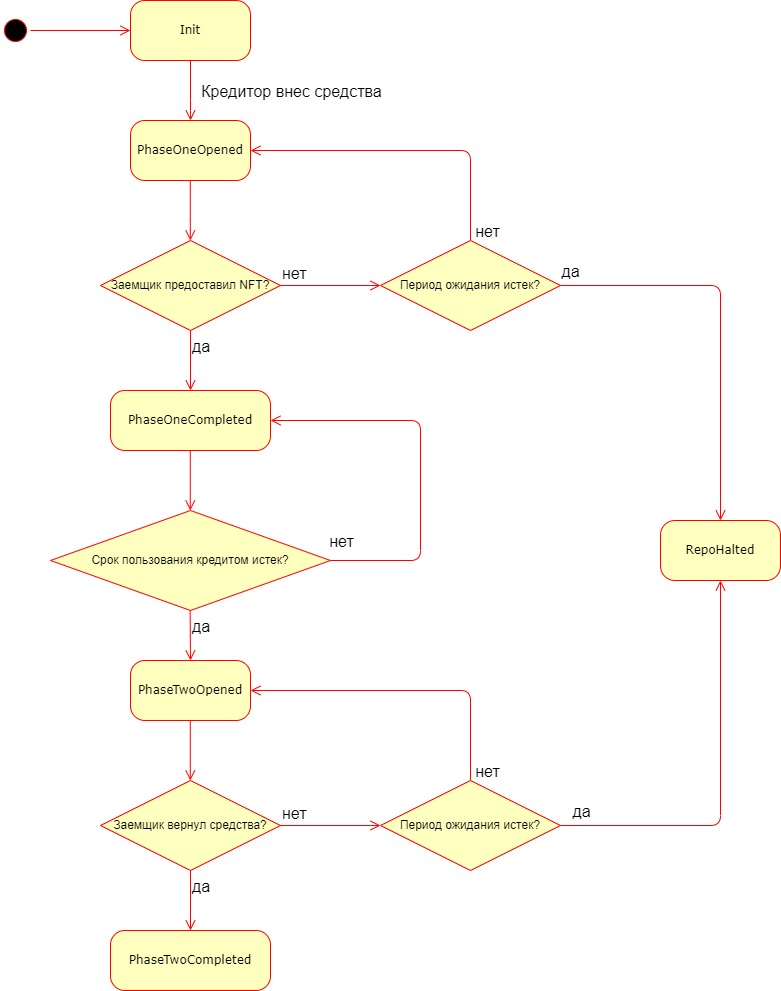
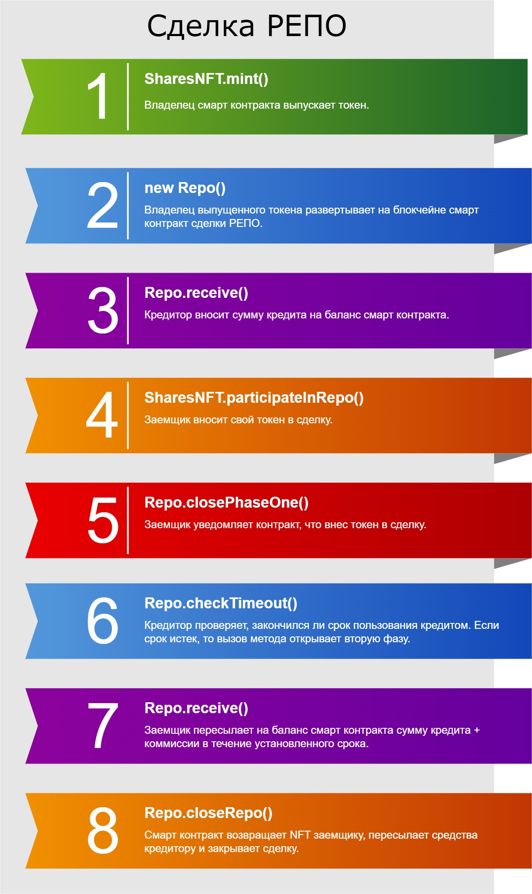

## Смарт контракт для проведения сделок РЕПО

Сделка РЕПО - сделка купли (продажи) ценной бумаги с обязательством обратной продажи (покупки) через определённый срок по заранее определённой в этом соглашении цене (https://ru.wikipedia.org/wiki/%D0%A1%D0%B4%D0%B5%D0%BB%D0%BA%D0%B0_%D0%A0%D0%95%D0%9F%D0%9E). Данный контракт (набор контрактов) реализует ее в следующем виде:

- Владелец акций (далее заемщик) токенизирует свой актив. Предполагаем, что данный шаг происходит офф-чейн. Биржа размещает смарт контракт, который позволяет ей выпускать NFT. Заемщик приходит на биржу, доказывает свое право владения акциями и просит выпустить на них NFT. Биржа берет у него эти акции на хранение, а сама выпускает на своей площадке токен, который подтверждает, что у заемщика есть права на эти активы. Любой желающий может обратиться к смарт контракту биржи и проверить, что это действительно так.
- Владелец создает смарт контракт сделки РЕПО, в котором при создании фиксируется предмет сделки - токен на акции, - а также адреса заемщика (он же владелец контракта) и кредитора в блокчейне Ethereum.
- Далее начинается первая фаза сделки. Кредитор переводит на баланс смарт контракта оговоренную сумму кредита.
- Заемщик видит, что нужная сумма поступила на баланс контракта и передает ему во временное распоряжение NFT.
- Смарт контракт переводит заемщику сумму кредита и передает NFT во владение кредитору. Первая фаза сделки закрывается.
- Проходит оговоренный период времени и открывается вторая фаза сделки.
- Теперь заемщик должен вернуть взятый кредит плюс коммиссию. Тогда NFT возвращается в его пользование, а сумма кредита с коммиссией - на адрес кредитора. Сделка завершается.
- Если он не делает этого в течение определенного срока, то право владения акциями навсегда закрепляется за кредитором. Сделка завершается.

В смарт контракте приведенная логика описывается конечным автоматом, имеющим состояния:
- Init - начальная фаза;
- PhaseOneOpened - первая фаза, кредитор внес кредит на баланс;
- PhaseOneCompleted - заемщик предоставил NFT, первая фаза закрыта, но, прежде чем открыть вторую фазу, должен пройти срок пользования кредитом;
- PhaseTwoOpened - вторая фаза открыта;
- PhaseTwoCompleted - заемщик вернул средства, и сделка успешно завершена;
- RepoHalted - сделка завершилась неудачно (истек один из двух таймаутов).

Диаграмма состояний имеет вид:



Описанный функционал реализуется с помощью двух смарт контрактов:
- SharesNFT (SharesNFT.sol) - контракт для выпуска NFT.
- Repo (Repo.sol) - контракт для проведения сделки РЕПО на блокчейне.

Опишем данные смарт контракты подробнее.

### SharesNFT

Смарт контракт основан на стандарте ERC721 (https://eips.ethereum.org/EIPS/eip-721) и наследует прописанный в спецификации интерфейс. То есть выпускаемые токены являются ERC721-совместимыми. Помимо этого смарт контракт реализует дополнительный интерфейс, который позволяет использовать выпускаемые NFT в сделке РЕПО.


```javascript
    function mint(
        address _to, 
        uint256 _tokenId,
        string calldata _company,
        uint256 _amount
    );
```
Функция mint() позволяет выпускать новые NFT на акции. Только владелец смарт контракта может вызвать данную функцию. Предполагается, что биржа развертывает данный контракт на блокчейне, и владелец акций приходит на биржу и договаривается с администрацией, чтобы его активы были токенизированы.

Сами акции представлены в смарт контракте, помимо записи о своем владельце, структурой:


```javascript
    struct Share {
        string company;
        uint256 amount;
        bool repo_participating;
    }
```

В структуре содержатся данные о компании, на которую акции выпущены, их количестве, а также специальный флаг, показывающий, участвует ли данный токен в РЕПО. На NFT, участвующий в сделке РЕПО, накладываются специальные ограничения, о чем будет далее рассказано подробнее.

```javascript
    function changeContractOwner(address _newOwner); 
```

Функция changeContractOwner() позволяет владельцу (бирже) передать свои права. Естественно, данный метод может вызываться только владельцем контракта.

```javascript
    function burn(uint256 _tokenId); 
```

Функция burn() уничтожает NFT с данным идентификатором. Данный метод может вызвать только владелец уничтожаемого токена. Предполагается, что данный процесс сопряжен с некоторыми офф-чейн действиями. Владелец акций приходит на биржу, просит вернуть ему свои акции, после чего уничтожает токен.

**Внимание** Функция burn() не может закончиться успехом, если токен участвует в сделке РЕПО.

```javascript
    function participateInRepo(
        address _repoContract,
        uint256 _tokenId
    );
```

Функция participateInRepo() может быть вызвана только владельцем токена. Метод должен быть вызван после того, как был создан контракт РЕПО сделки, и кредитор внес на его баланс нужную сумму. Чтобы закрыть первую фазу, заемщик должен вызвать данную функцию и уведомить об этом смарт контракт. При этом NFT помечается как участвующая в РЕПО.

**Внимание** После этого, как токен помечается участвующим в сделке РЕПО, соответствующий смарт контракт Repo назначается approval на него. Отныне Repo может менять владельца токена по своему усмотрению. При этом никто, даже сам владелец NFT, не может назначить нового approval'а или же переслать токен другому лицу. Пока сделка РЕПО открыта, только смарт контракт может распоряжаться токеном, а также закрыть сделку, передав окончательно права на актив одной из сторон.

```javascript
    function getRepoStatus(uint256 _tokenId); 
```

Функция getRepoStatus() возвращает значение состояния repo_participating токена.

```javascript
    function closeRepo(uint256 _tokenId);
```

Функция closeRepo() закрывает текущую РЕПО сделку. Метод может быть вызван адресом, являющимся approval'ом и только при условии, что токен участвует в сделке. Это значит, что он может быть успешно вызван только соответствующим смарт контрактом Repo. После этого Repo удаляется из списка approval'ов, флаг repo_participating становится false, и NFT переходит в постоянное владение текущему владельцу.


### Repo


Смарт контракт реализует логику РЕПО сделки (при поддержке контракта SharesNFT). Объявление его конструктора выглядит следующим образом:

```javascript
    constructor(
        address _sharesAddress,
        address payable _lenderAddress,
        uint256 _tokenId,
        uint256 _loan,
        uint256 _commission,
        uint256 _dealTime        
    );
```

Смарт контракт обязательно создается владельцем токена, который хранится по адресу _sharesAddress и имеет идентификатор _tokenId. Данное NFT будет объектом сделки. Также при создании определяется адрес кредитора (_lenderAddress), размер кредита (_loan), размер коммиссии, которую предстоит выплатить заемщику (_commission), а также период между закрытием первой фазы и открытием второй (_dealTime).

```javascript
    function changeTimeout(uint256 _newTimeout);
```

У сделки есть параметр таймаута, который используется в обоих фазах. В первой - после того как кредитор внес кредит заемщик должен в течение периода, равного таймауту, передать токен под управление Repo. Иначе средства возвращаются кредитору, и сделка признается несостоявшейся. Во второй фазе - после ее открытия заемщик должен внести средства в размере кредита + коммиссии на баланс контракта в течение периода, равного таймауту. Иначе сделка признается несостоявшейся, и NFT переходит в постоянное владение кредитору.

По умолчанию период таймаута составляет 1 день. Если необходимо другое значение, то его может установить только владелец контракта и только до момента внесения кредитором средств на баланс контракта (по ходу сделки менять ее параметры нельзя).

```javascript
    function checkTimeout();
```

По условию сделки есть три этапа, ограниченные временными рамками: на первой фазе в состоянии, когда кредитор внес кредит, но заемщик еще не передал NFT; между закрытием первой фазы и открытием второй фазы; на второй фазе в состоянии, когда заемщик еще не вернул средства в полном объеме. Чтобы зафиксировать истечение срока и перевести сделку в новое состояние, необходимо вызвать функцию checkTimeout(). Скорее всего это будет делать заинтересованное лицо - кредитор. Пока контракт не зафиксирует событие, кредитор не сможет ни вернуть средства на первой фазе, ни открыть вторую фазу, ни получить токен в свое владение на второй фазе.

```javascript
    function closePhaseOne();
```

Чтобы закрыть первую фазу, заемщик должен передать NFT контракту. Для этого он должен сначала вызвать метод participateInRepo() в смарт контракте SharesNFT, а затем уведомить об этом смарт контракт Repo вызовом метода closePhaseOne().

```javascript
    function transmitLenderRights(address _newLender);
```

Кредитор вправе передать свои права на сделку РЕПО другому лицу, но только во временном интервале между закрытием первой фазы и открытием второй. Сделать это он может, вызвав метод transmitLenderRights().

```javascript
    function getCurrentState();
```

Можно узнать текущее состояние сделки, вызвав метод getCurrentState(). Обратите внимание, что метод вернет целое число, которое можно сопоставить с состоянием:
- 0 - Init;
- 1 - PhaseOneOpened;
- 2 - PhaseOneCompleted;
- 3 - PhaseTwoOpened;
- 4 - PhaseTwoCompleted;
- 5 - RepoHalted.

```javascript
    function destroy();
```

После завершения сделки - не важно, удачно или нет - смарт контракт становится бесполезен и может быть уничтожен своим владельцем. Также метод может быть вызван на начальной стадии, пока кредитор не внес средства на баланс (в полном размере! Если кредитор внес только часть средств, то вызов destroy() переведет эту сумму на адрес владельца контракта! Кредитору стоит учитывать этот нюанс!).

В итоге, проведение сделки (успешный сценарий) на уровне вызова функций выглядит следующим образом:

        